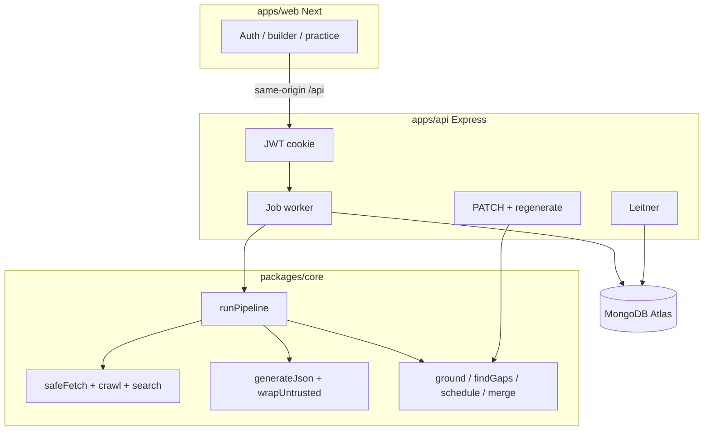

# Prep Kit

Interview prep kit generator ([Trao FS-AI-INTERVIEW-01](docs/SPEC.md)). Paste a job description, a company URL, and days until the interview. The pipeline crawls the company site, searches public interview discussion, grounds requirements in the JD, and builds a kit: company brief, role breakdown, question bank, flashcards, and a day-by-day schedule. You can edit any part, regenerate one section without losing edits, and practise flashcards in-app.

**Live app:** [https://prep-kit-rho.vercel.app](https://prep-kit-rho.vercel.app)  
**API health:** [https://prep-kit-fjgi.onrender.com/health](https://prep-kit-fjgi.onrender.com/health)  
**GitHub:** [https://github.com/Anshul3977/TraoAssignment](https://github.com/Anshul3977/TraoAssignment)

The browser talks only to the Next origin (`/api/*`); Vercel rewrites that prefix to Express. Free Render instances sleep after idle — the first request after sleep is often ~50s.

---

## What the model does vs what code decides

The model drafts text. **Code owns every decision that would change scores if the model got it wrong.**

| Decision | Owner | Why |
|---|---|---|
| Schedule days, minutes, question placement | `allocateSchedule` (pure) | SPEC §8: arithmetic in code, not a prompt |
| Coverage gaps (must before nice) | `findGaps` (pure) | SPEC §3 / §4: comparing questions vs requirements is never the model's job |
| Requirement ids (`r1…`), question/flashcard ids | `assignIds` / step post-process | Stable ids; the model must not mint colliding ids |
| Must vs nice when the JD has a cue | `groundRequirements` (heading + evidence phrases) | "required" ≠ "bonus"; model label is last |
| Which URLs are cited in `sources` | Filter to URLs actually fetched | Model cannot invent citations |
| Whether to generate system-design questions | Code: hiring stage **or** seniority ≥ senior **or** req text mentions architecture/scale | Categories are not one prompt with one instruction set |
| Question category routing on the coverage pass | Requirement `kind` → generate function | Technical vs behavioural must be separate calls |
| Which sources are skipped | `safeFetch` / crawl log | Failed fetch never throws out of the pipeline |
| Merge on regenerate (keep edited/pinned/user) | `mergeRegenerated` | SPEC §6: regeneration must not discard edits |

LLM output is always `generateJson`: parse → zod → one repair call with the validation errors → typed error. Untrusted JD and page text enter prompts **only** via `wrapUntrusted(source, text)`.

---

## Overview and stack

Preferred stack from the spec: Next.js + Tailwind, Node + Express, MongoDB, TypeScript, an LLM with a genuine free tier.

| Piece | Choice | Deviation / justification |
|---|---|---|
| Web | Next.js 15 App Router + Tailwind | Spec stack. Same-origin `/api/*` rewrites so the session cookie is first-party. |
| API | Express + Mongoose | Spec stack. In-process job worker (no extra queue service on free tier). |
| Core pipeline | `packages/core` — pure TypeScript | No Express/Mongo in core so the **batch CLI and API call the same `runPipeline`**. |
| LLM | Gemini primary (`gemini-flash-lite-latest`), Groq fallback (`llama-3.3-70b-versatile`) | Free-tier RPM; sliding-window limiter + retry + provider fallback. |
| HTML | cheerio | Spec-allowed. Title, links, main text. |
| robots | `robots-parser` | SPEC §2: respect robots.txt. |
| Domain | `tldts` | Needed to follow `handbook.gitlab.com` from `about.gitlab.com` (eTLD+1) without hard-coded hosts. Allowed extra; noted in progress. |
| Tests | vitest next to source | Schedule, coverage, `validateKit`, fake-provider LLM steps. |

npm workspaces: `packages/core`, `apps/api`, `apps/web`. Node ≥ 20.

---

## Architecture



**Step sequence (genuine, not one prompt):**

1. Validate input (non-empty JD, http(s) URL, integer days ≥ 1).
2. Extract requirements from the **JD only** (no crawl). Ground: drop ungrounded evidence, override priority from JD cues, ids in JD order. Thin JD → thin kit + `notes.thin_jd`.
3. Crawl company site (rank links; no hard-coded hiring paths) → search public discussion.
4. Company brief from homepage/about; interview process from hiring pages + discussion.
5. Four **separate** question generators (technical, behavioural, system-design if code says so, company-fit).
6. Coverage loop (draft → up to 3 passes → deterministic must fallbacks).
7. Flashcards (code guarantees ≥1 card per must) → `allocateSchedule` → `validateKit`.

Progress events: `{ step, status: running | done | skipped | failed, detail? }`.

**FAQ:** `status: failed` only when **no kit can be produced** (`EMPTY_JD`, `LLM_UNAVAILABLE`, `INVALID_INPUT`, `INVALID_KIT`). Unreachable company, missing hiring page, empty discussion, and skipped sources are **ok kits** with `research_log` filled in. Partial research is not failure.

---

## Retrieval and sources used

Crawl starts at `company_url`, stays on the seed’s registrable domain, BFS depth ≤ 3, page budget ≤ 15, score-ordered fetches. Ranking uses hiring/about keywords in **anchor text + path + page text** — never a fixed path list.

`safeFetch`: http/https only; DNS + block private/loopback/link-local in production unless `ALLOW_PRIVATE_HOSTS=true`; ≤5 redirects re-checked each hop; 10s timeout; 2 MB stream cap; content-type allowlist (html, xhtml, plain, xml); identifiable User-Agent; ≥500 ms per host; retry on network/5xx/429.

**Sources the pipeline may contact (SPEC §2 — list what we use):**

| Source | When | Auth |
|---|---|---|
| The user-supplied company origin (and same eTLD+1 links) | Always, via crawl | None |
| `/robots.txt` at that origin | Before fetch | None |
| `sitemap.xml` if present | Crawl seed | None |
| [HN Algolia](https://hn.algolia.com/api/v1/search) | Discussion search | None |
| DuckDuckGo HTML (`html.duckduckgo.com`) | After HN, best effort | None |
| Brave / Tavily search APIs | Only if `SEARCH_API_KEY` is set | Key |
| Gemini / Groq APIs | Generation | Provider keys |

We do **not** scrape job boards (Greenhouse / Lever / Ashby) as a follow-on host. Discussion hits that do not mention the company name are dropped. Failed sources go to `research_log.skipped` with a reason.

**robots.txt and site terms:** fetches honour origin `robots.txt` (robots-parser, cached). Path-prefixed fixture robots files are a known limitation (only origin `/robots.txt` is read). We rate-limit and identify the User-Agent; do not use this crawler against sites whose terms forbid automated access beyond what robots.txt allows.

---

## Coverage stop rule (why 3)

SPEC §4: a kit that ships with uncovered **must** requirements has failed. Nice gaps may remain and are listed.

1. **Pass 1** — category drafts. `findGaps` in code.
2. **While must-gaps remain and passes < 3** — generate **only** those must-gap requirements, routed by `kind`, then `findGaps` again.
3. **After pass 3** — one deterministic fallback question per remaining must (`meta.origin = 'fallback'`). Nice-only gaps never start another pass.

Three is the cap because: one extra LLM pass usually closes an accidental miss; a second extra pass is still cheaper than infinite loops on a stubborn model; after that the model has twice failed the same musts, so **code** writes a grounded fallback instead of inventing more prose. `coverage.passes` and `research_log.coverage_passes` record the trail. Empty banks on thin/nice-only JDs get a fallback question per grounded requirement so schedules are never all-empty days.

---

## Unreachable company is still an ok kit

If the company URL 404s, times out, or is otherwise unreachable, `runPipeline` still returns a kit from the JD: honest brief (“we could not fetch …”), `research_log.company_unreachable = true`, `pages_used` only URLs actually fetched. Missing hiring page → `interview_process.found = false`, not `failed`. Unknown company → no fabricated about-section. The fixture case with `http://localhost:8099/does-not-exist/` is this path.

---

## Builder state model (generated / edited / pinned / dismissed / version)

SPEC §6: “hardest state problem.” Extra fields live on `meta` (Appendix A names stay exact).

| Flag | Meaning | Survives regenerate of its section? |
|---|---|---|
| `origin: generated` | Model (or pipeline) wrote it | **No** — replaced if unedited and unpinned |
| `origin: fallback` | Deterministic coverage/flashcard fallback | Same as generated (delete records dismissed) |
| `origin: user` | Added in the builder | **Yes** |
| `edited: true` | User changed prompt/outline/text | **Yes** (kept in place) |
| `pinned: true` | User pinned | **Yes** |
| `brief.meta.edited` | Brief text edited | Brief regen skipped unless `force` |
| `kit.meta.dismissed[]` | Normalised prompts of deleted generated/fallback questions | **Not resurrected** |
| `kit.meta.next_ids` | Next r/q/f integers | New items never reuse ids |
| `kit.version` | Integer optimistic concurrency | `PATCH` / regenerate send `baseVersion`; mismatch → `409 VERSION_CONFLICT` + current kit |

`mergeRegenerated` keeps user/edited/pinned items in place, swaps only untouched generated items in that section, re-runs `findGaps` + fallbacks for the category, and re-allocates the schedule in code when questions change. The UI flushes debounced PATCH ops before regenerate so `baseVersion` matches. Story Bank is stored on the Kit document, **not** Appendix A, and does not bump `version`.

---

## Schedule allocation (§8)

`allocateSchedule` — no LLM.

- Score = `(must=2, nice=1) × 10` + `difficulty × 3` + `5` if the question is the **only** cover for a must.
- Minutes: difficulty 1→10, 2→20, 3→30 (integers).
- Exactly `N` days (`days_available`). Learning = first `ceil(N × 0.7)` days (min 1); remaining days are review/mock; last day labelled mock / weak spots.
- Greedy fill: high scores first, earlier days preferred, 180-minute cap (overflow noted, day not emptied).
- Extra days when `N` > questions become spaced review — never an empty day if any question exists.
- Every must-have requirement appears in some scheduled `question_ids`. Focus label = dominant category/requirement of that day.

---

## Practice (why Leitner)

Confidence 1–5 on one card at a time (Space/Enter reveal; keys 1–5).

**Leitner boxes, not a one-shot sort of last confidence**, because interview prep is multi-session: a card you just crushed should wait; a card you missed should come back tomorrow. Boxes are a small, inspectable spaced-repetition model that matches SPEC §7 (“pick and defend”).

| Confidence | Box update |
|---|---|
| ≤ 2 | box 1 |
| 3 | box 2 |
| ≥ 4 | box + 1 (max 5) |

**Next session order:** box ascending, then last-confidence ascending, then least-recently-seen. Never-seen cards are interleaved **early** so new material is not starved. Ordering is computed on the API; the client does not re-sort. Stats: a requirement is covered if ≥1 linked flashcard has been reviewed.

---

## Creative feature: Story Bank

People often write a unique answer per behavioural question and freeze. Story Bank: write 4–6 STAR stories once. **Code** maps stories onto behavioural requirements/questions with stemmed keyword overlap (no LLM). Requirements with no overlap are flagged (`You have no story for 'mentoring juniors'`). Practice shows a matching story as a hint. Routes: `GET`/`PUT /kits/:id/story-bank` (see `docs/API.md`).

---

## Edge cases (§10)

| Case | Behaviour |
|---|---|
| Invalid / 404 / timeout company URL | Kit **ok** from JD; `research_log.skipped` + `company_unreachable` when the origin never loaded; never abort the run |
| No hiring or about page | Honest brief; `interview_process.found = false`; `sources` only fetched URLs |
| Two-line stub JD | Ground what is literally there; `notes.thin_jd = true`; do **not** invent requirements |
| Discussion finds nothing | `[]` + log; kit still ok |
| Invalid / incomplete model JSON | One repair call with zod errors; then `LlmError` / kit fail only if still unusable |
| LLM 429 / brief outage | Retry + backoff (honour Retry-After); fall back Gemini ↔ Groq; limiter is process-wide |
| Same JD + company + days twice | Idempotency `sha256(userId + normalised JD + URL + days)` → same job (`200`), no second pipeline |
| 1-day schedule | One learning/mock day; all musts still appear |
| 60-day schedule | 60 days, no empty days (spaced review fills extras) |
| Prompt injection on a crawled page | Page text only inside `wrapUntrusted`; COBOL-style planted requirements are dropped at grounding |

Inventing requirements is worse than a thin kit.

---

## Security (§11)

- **SSRF:** parse URL (http/https); resolve DNS; block private, loopback, and link-local IPs when `NODE_ENV=production` unless `ALLOW_PRIVATE_HOSTS=true`. Re-validate every redirect hop. CLI evaluate **allows** private hosts so localhost fixtures work.
- **Type / size:** HTML/XHTML/plain/XML; 2 MB cap; 10s abort.
- **Prompt injection:** JD and fetched pages are data. `wrapUntrusted` wraps `<untrusted_document source="…">` and neutralises embedded closing tags. System prompt states they are not instructions.
- **Auth:** httpOnly `session` cookie, `SameSite=Lax`, `Secure` in production. Kits scoped by `userId` (foreign id → 404). `401 UNAUTHENTICATED` vs `SESSION_EXPIRED`. Helmet + rate limit on Express. No CORS: the browser never calls Render origin directly.

---

## Job lifecycle (§13)

Generation is ~90s of crawl + LLM. The API does **not** run `runPipeline` on the HTTP thread for `POST /kits`.

| Situation | Behaviour |
|---|---|
| Create kit | Enqueue in-process worker; poll `GET /jobs/:id`; steps persist so leaving the page is safe |
| Fails halfway | Job `failed` with a code; kit not saved unless `validateKit` passed; `POST /jobs/:id/retry` |
| Process restart mid-run | Boot marks leftover `running` jobs `INTERRUPTED` (retryable) |
| Double submit | Same idempotency key → existing queued/running/done/failed job, no parallel pipeline |
| Batch file | `POST /kits/batch` (1–50 rows); each row is its own job |
| Regenerate | Synchronous LLM on the request (Render 3 min Node timeout; Vercel rewrite may 504 on Hobby — retry when warm) |

---

## Setup (local)

```bash
npm install
cp .env.example .env   # Windows: copy .env.example .env
```

Fill at least `GEMINI_API_KEY` or `GROQ_API_KEY`, plus `JWT_SECRET` and `MONGODB_URI` for the API. Defaults: `LLM_PROVIDER=gemini`, `GEMINI_MODEL=gemini-flash-lite-latest`, `GROQ_MODEL=llama-3.3-70b-versatile`. All variables are in `.env.example`.

```bash
npm run typecheck
npm test
npm run fixtures                                          # :8099
npm run evaluate -- --input fixtures/cases.json --output out/kits.json
npm run check-output -- --input out/kits.json
```

Exact batch command (SPEC §9) — **same `runPipeline` as the API**:

```bash
npm run evaluate -- --input fixtures/cases.json --output out/kits.json
```

CLI allows private hosts, concurrency 1 at the entry (shared limiter; free-tier RPM), ~8 min per-case timeout, continues after a failed case, rewrites Appendix B after each case. Exit 0 when the batch finishes. On some Windows npm versions, flags are eaten; positionals work: `npm run evaluate -- fixtures/cases.json out/kits.json`.

### API + web locally

```bash
npm run dev --workspace=@prep/api    # PORT=4000, needs JWT_SECRET + MONGODB_URI
npm run dev --workspace=@prep/web    # http://localhost:3000
```

Optional `ALLOW_PRIVATE_HOSTS=true` for fixture company URLs. HTTP contract: [`docs/API.md`](docs/API.md).

---

## Setup (deployed)

Do **not** add CORS. Set secrets in dashboards only.

**MongoDB Atlas M0** — SRV URI; network `0.0.0.0/0` on free egress (or pin IPs).

**API — Render** ([`render.yaml`](render.yaml)): `NODE_ENV=production`, `PORT` (platform), `JWT_SECRET`, `MONGODB_URI`, `LLM_PROVIDER`, `GEMINI_API_KEY` (and optional Groq / search). Leave `ALLOW_PRIVATE_HOSTS` unset. Health: `GET /health` → `{ ok: true }` after Mongo connects. Listen `0.0.0.0`.

**Web — Vercel** (root `apps/web`, [`apps/web/vercel.json`](apps/web/vercel.json)): `API_ORIGIN` = public Render URL, **no trailing slash**, baked at `next build`. Production: `https://prep-kit-fjgi.onrender.com`. Redeploy web after the API URL changes.

---

## Layout and product surface

- `packages/core` — schema, retrieval, LLM, deterministic steps, `runPipeline`, batch CLI
- `apps/api` — auth, persistence, jobs, edit/regenerate, practice, Story Bank
- `apps/web` — auth, create/batch, job timeline, builder, practice, schedule + coverage matrix, Story Bank
- `fixtures/` — local sites + `cases.json`

Builder: debounced PATCH (600 ms), origin badges, `@dnd-kit` reorder (keyboard), regenerate confirm listing what is kept, `409` merge prompt (never silent overwrite). Practice and coverage matrix consume API/pipeline fields rather than recomputing policy on the client. A11y: focus-trapped dialogs, `aria-live` save/job status, 375px gutters, skip link, error boundary.

---

## Trade-offs and known limitations

- **Free-tier RPM** forced CLI concurrency 1 and a process-wide limiter. Correctness over wall-clock on Gemini flash-lite.
- **Render sleep ~50s** and `INTERRUPTED` after deploys are free-tier costs; jobs are retryable.
- **Vercel Hobby proxy** can cut long synchronous regenerates; create-kit stays async.
- **Job-board hosts** are off-site and not followed.
- **Client-rendered shells** with near-empty cheerio text are logged as skipped/other — not proof that hiring is missing.
- **Discussion without `SEARCH_API_KEY`** is HN + DuckDuckGo HTML only.
- **Story overlap is lexical** (no synonyms).
- **Dashboard kit list** is not in the original API contract — empty state + job → builder.
- Do not invent a live URL: this README’s Vercel/Render links were verified with `/health` and a public login page.

Pipeline usage from code:

```ts
import { runPipeline } from "@prep/core";

const { kit } = await runPipeline(
  { jd, company_url, days },
  { allowPrivateHosts: true, onProgress: console.log },
);
```
